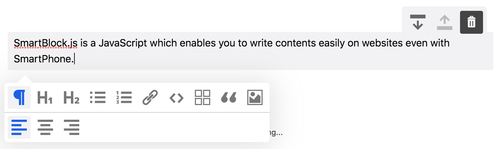

# SmartBlock


[](https://badge.fury.io/js/smartblock)
[](https://www.npmjs.com/package/smartblock)
[](https://raw.githubusercontent.com/appleple/smartblock/master/LICENSE)


SmartBlock.js is a JavaScript block based editor which enables you to write contents easily on websites even with **SmartPhone**.

| [](http://godban.github.io/browsers-support-badges/)</br>IE11 / Edge | [](http://godban.github.io/browsers-support-badges/)</br>Firefox | [](http://godban.github.io/browsers-support-badges/)</br>Chrome | [](http://godban.github.io/browsers-support-badges/)</br>Safari | [](http://godban.github.io/browsers-support-badges/)</br>iOS Safari | 
| --------- | --------- | --------- | --------- | --------- | 

## ScreenShot



## Features

*   Easy to use with SmartPhone
*   Fully customizable
*   Block based
*   Keep clean HTML and wipe out unnecessary tags
*   Get the result as **HTML** or **JSON**
*   copy and paste contents

## Install

```sh
$ npm install smartblock --save
```

## Usage

```js
import * as React from 'react';
import { render } from 'react-dom';
import { SmartBlock, GlobalStyle, Extensions } from 'smartblock';

render(<>
  <GlobalStyle />
  <SmartBlock 
    extensions={Extensions}
    html={'<h2>Hello World</h2><p>hello</p>'}
    onChange={({ json, html }) => { console.log(json, html);}}  
  />
</>, document.getElementById("app"));
```


## Try it on CodeSandbox

[](https://codesandbox.io/s/hardcore-kalam-tghp9?fontsize=14&hidenavigation=1&theme=dark)


## Customize

You can add custom block like this

```js
import { Extensions, CustomBlock, CustomMark } from 'smartblock';
Extensions.push(new CustomBlock({  tagName: 'div',  className: '.alert',  icon: <SomeIconComponent />});

render(<>
  <GlobalStyle />
  <SmartBlock 
    extensions={Extensions}
    html={'<h2>Hello World</h2><p>hello</p>'}
    onChange={({ json, html }) => { console.log(json, html);}}  
  />
</>, document.getElementById("app"));
```

You can add custom inline element like this

```js
import { Extension, CustomBlock, CustomMark } from 'smartblock';
Extension.push(new CustomMark({  tagName: 'span',  className: '.small',  icon: <SomeIconComponent />});

render(<>
  <GlobalStyle />
  <SmartBlock 
    extensions={Extensions}
    html={'<h2>Hello World</h2><p><small>hello</small></p>'}
    onChange={({ json, html }) => { console.log(json, html);}}  
  />
</>, document.getElementById("app"));
```

## Options

| Props        | description                                                                                                 | type               | default                                                                                                                                                                                                                                                                                                                                                                 |
| ------------ | ----------------------------------------------------------------------------------------------------------- | ------------------ | ----------------------------------------------------------------------------------------------------------------------------------------------------------------------------------------------------------------------------------------------------------------------------------------------------------------------------------------------------------------------- |
| extensions   | Array of extensions which extend the feature of SmartBlock                                                  | Extension[] | array of extensions |
| onChange     | Callback function which is called when the content of the editor is changed. You can get both html and json | Function           |                                                                                                                                                                                                                                                                                                                                                                         |
| onInit       | Callback function which is called when the editor is initialized                                            | Function           |                                                                                                                                                                                                                                                                                                                                                                         |
| json         | The editor contents will be initialized with the json data                                                  | Object             | {}                                                                                                                                                                                                                                                                                                                                                                      |
| HTML         | The editor contents will be initialized with the HTML                                                       | String             | ''                                                                                                                                                                                                                                                                                                                                                                      |
| showTitle    | Title will be shown                                                                                         | Boolean            | false                                                                                                                                                                                                                                                                                                                                                                   |
| showBackBtn  | Btn to support history back will be shown                                                                   | Boolean            | false                                                                                                                                                                                                                                                                                                                                                                   |
| autoSave     | The HTML will be stored to the localstorage every time the content is changed                               | Boolean            | false                                                                                                                                                                                                                                                                                                                                                                   |
| getEditorRef | Get the editor ref object                                                                                   | Function           |                                                                                                                                                                                                                                                                                                                                                                         |
## Download
[Download ZIP](https://github.com/appleple/smartblock/archive/master.zip)

## Github
[https://github.com/appleple/smartblock](https://github.com/appleple/smartblock)

## Contributor
[@steelydylan](https://github.com/steelydylan)

## License
Code and documentation copyright 2020 by appleple, Inc. Code released under the [MIT License](https://github.com/appleple/smartblock/blob/master/LICENSE).