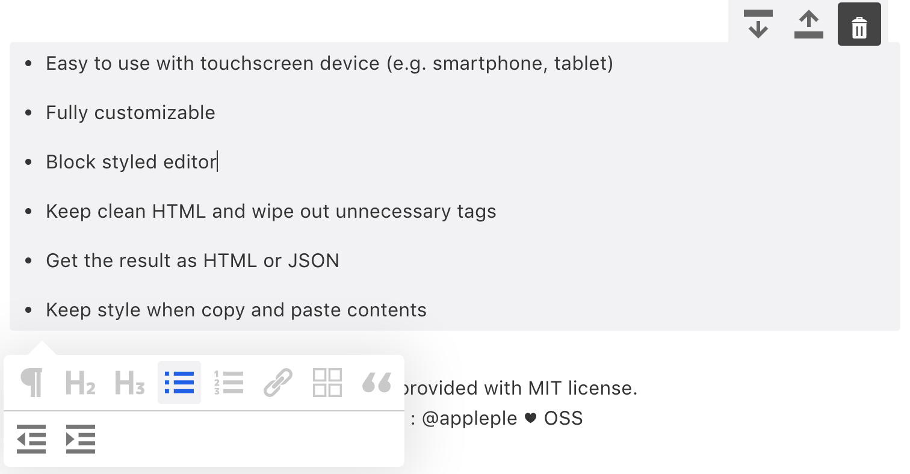
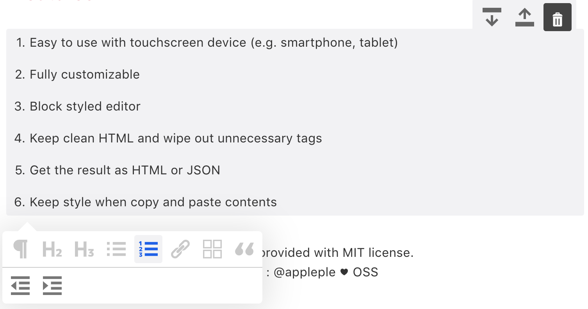
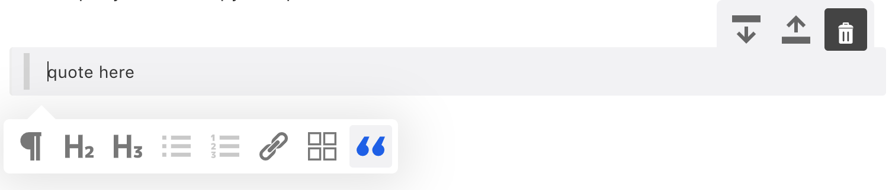
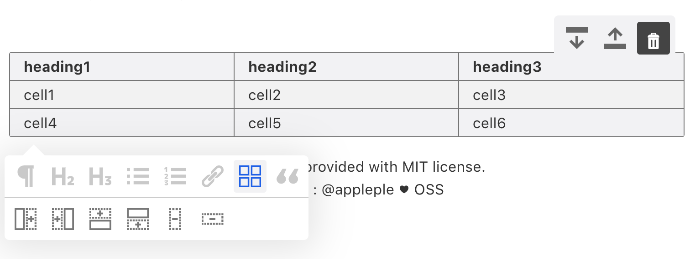
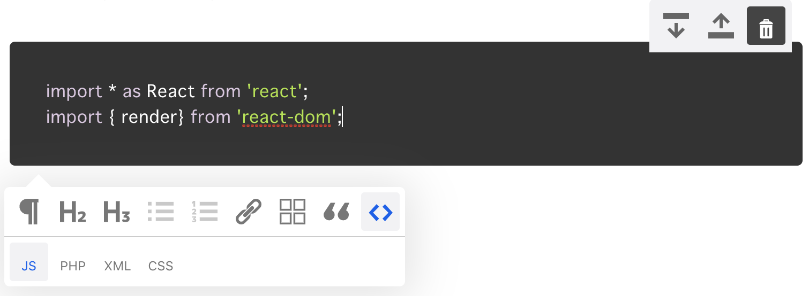

### Paragraph

Paragraph Extension creates paragraph(p) block to the content.
You can add it like below


```jsx
import * as React from 'react';
import { render } from 'react-dom';
import { 
  SmartBlock, 
  GlobalStyle, 
} from 'smartblock';

render(<>
  <GlobalStyle />
  <SmartBlock 
    extensions={extensions}
    html={'<h2>Hello World</h2><p>hello</p>'}
    onChange={({ json, html }) => { console.log(json, html);}}  
  />
</>, document.getElementById("app"));
```

### Heading1

Paragraph Extension creates heading1(h1) block to the content.
You can add it like below


```jsx
import * as React from 'react';
import { render } from 'react-dom';
import Base from 'smartblock/lib/extensions/base';
import { 
  SmartBlock, 
  GlobalStyle, 
  Heading1
} from 'smartblock';

const extensions = [
  ...Base,
  new Heading1()
];

render(<>
  <GlobalStyle />
  <SmartBlock 
    extensions={extensions}
    html={'<h1>Hello World</h1><p>hello</p>'}
    onChange={({ json, html }) => { console.log(json, html);}}  
  />
</>, document.getElementById("app"));
```

### BulletList

Paragraph Extension creates bullet-list(ul) block to the content.
You can add it like below



```jsx
import * as React from 'react';
import { render } from 'react-dom';
import Base from 'smartblock/lib/extensions/base';
import { 
  SmartBlock, 
  GlobalStyle, 
  BulletList,
  ListItem
} from 'smartblock';

const extensions = [
  ...Base,
  new BulletList(),
  new ListItem()
];

render(<>
  <GlobalStyle />
  <SmartBlock 
    extensions={extensions}
    html={`<ul>
      <li>list item 1</li>
      <li>list item 2</li>
    </ul>`}
    onChange={({ json, html }) => { console.log(json, html);}}  
  />
</>, document.getElementById("app"));
```


### OrderdList

Paragraph Extension creates bullet-list(ul) block to the content.
You can add it like below



```jsx
import * as React from 'react';
import { render } from 'react-dom';
import Base from 'smartblock/lib/extensions/base';
import { 
  SmartBlock, 
  GlobalStyle, 
  OrderedList,
  ListItem
} from 'smartblock';

const extensions = [
  ...Base,
  new OrderedList(),
  new ListItem()
];

render(<>
  <GlobalStyle />
  <SmartBlock 
    extensions={extensions}
    html={`<ol>
      <li>list item 1</li>
      <li>list item 2</li>
    </ol>`}
    onChange={({ json, html }) => { console.log(json, html);}}  
  />
</>, document.getElementById("app"));
```


### Blockquote



```jsx
import * as React from 'react';
import { render } from 'react-dom';
import Base from 'smartblock/lib/extensions/base';
import { 
  ...Base,
  SmartBlock, 
  GlobalStyle, 
  Blockquote
} from 'smartblock';

const extensions = [
  new Blockquote()
];

render(<>
  <GlobalStyle />
  <SmartBlock 
    extensions={extensions}
    html={'<blockquote>quote here!</blockquote>'}
    onChange={({ json, html }) => { console.log(json, html);}}  
  />
</>, document.getElementById("app"));
```

### Embed


```jsx
import * as React from 'react';
import { render } from 'react-dom';
import Base from 'smartblock/lib/extensions/base';
import { 
  ...Base,
  SmartBlock, 
  GlobalStyle, 
  Embed
} from 'smartblock';

const extensions = [
  new Embed()
];

const embedHtml = `<div class="embed-wrap">
  <a href="https://horicdesign.com" class="embed">https://horicdsign.com</a>
</div>`;

render(<>
  <GlobalStyle />
  <SmartBlock 
    extensions={extensions}
    html={embedHtml}
    onChange={({ json, html }) => { console.log(json, html);}}  
  />
</>, document.getElementById("app"));
```

### Table



```jsx
import * as React from 'react';
import { render } from 'react-dom';
import Base from 'smartblock/lib/extensions/base';
import { 
  SmartBlock, 
  GlobalStyle, 
  Table
} from 'smartblock';

const extensions = [
  ...Base,
  new Table()
];

const tableHtml = `<table>
  <tr>
    <th>header1</th>
    <th>header2</th>
  </tr>
  <tr>
    <th>cell1</th>
    <th>cell2</th>
  </tr>
</table>`;

render(<>
  <GlobalStyle />
  <SmartBlock 
    extensions={extensions}
    html={tableHtml}
    onChange={({ json, html }) => { console.log(json, html);}}  
  />
</>, document.getElementById("app"));
```

### Image


```jsx
import * as React from 'react';
import { render } from 'react-dom';
import Base from 'smartblock/lib/extensions/base';
import { 
  SmartBlock, 
  GlobalStyle, 
  Image
} from 'smartblock';

const extensions = [
  ...Base,
  new Image({})
];

const codeHTML = ``;

render(<>
  <GlobalStyle />
  <SmartBlock 
    extensions={extensions}
    html={codeHtml}
    onChange={({ json, html }) => { console.log(json, html);}}  
  />
</>, document.getElementById("app"));
```

### Customize How to upload image
You can decide what to do after the image is selected like below

```js
new Image({
  onChange: async (preview: string, file: File) => {
    const res = await fetch('/url/to/post', {
      method: 'POST',
      headers: {
        'Content-Type': 'application/json'
      },
      body: JSON.stringify({ preview })
    })
    const json = await res.json();
    return json.url;
  }
})
```

### Code



```jsx
import * as React from 'react';
import { render } from 'react-dom';
import Base from 'smartblock/lib/extensions/base';
import { 
  SmartBlock, 
  GlobalStyle, 
  Code
} from 'smartblock';

const extensions = [
  ...Base,
  new Code()
];

const codeHTML = `<code class="js">import * as React from 'react';
import {render} from 'react-dom';</code>`;

render(<>
  <GlobalStyle />
  <SmartBlock 
    extensions={extensions}
    html={codeHtml}
    onChange={({ json, html }) => { console.log(json, html);}}  
  />
</>, document.getElementById("app"));
```