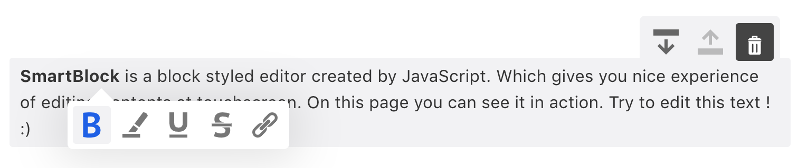
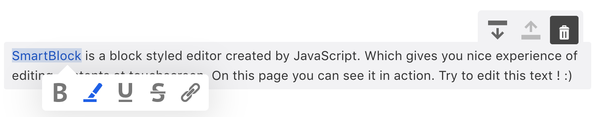
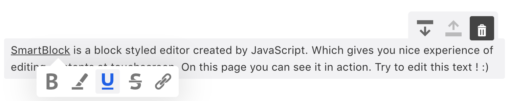
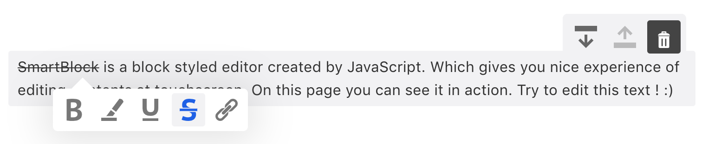
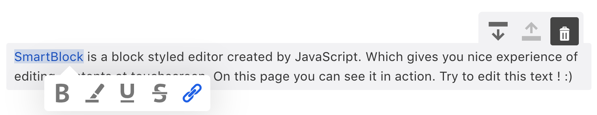
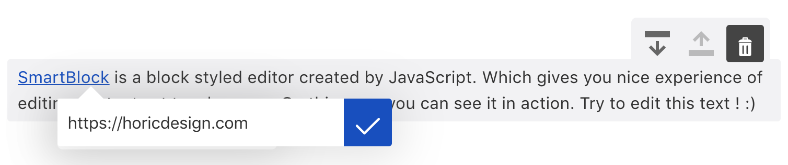

When selecting the texts the tooltip will be shown. When clicking the tooltip button, inline element will be inserted.
We call this marks.

Same as Block Extensions, You can just import and use.

### Strong



```jsx
import * as React from 'react';
import { render } from 'react-dom';
import Base from 'smartblock/lib/extensions/base';
import { 
  SmartBlock, 
  GlobalStyle, 
  Strong
} from 'smartblock';

const extensions = [
  ...Base,
  new Strong()
];

render(<>
  <GlobalStyle />
  <SmartBlock 
    extensions={extensions}
    html={'<p>hello <strong>world</strong></p>'}
    onChange={({ json, html }) => { console.log(json, html);}}  
  />
</>, document.getElementById("app"));
```

You can define how to parse html and output html like below by yourself

```js
new Strong({
  schema: {
    group: 'mark',
    parseDOM: [{ tag: 'strong' }],
    toDOM: function() {
      return ['strong', 0]
    }
  }
})
```

#### default schema

```js
{
  group: 'mark',
  parseDOM: [{ tag: 'strong' }, { style: 'font-weight=bold' }],
  toDOM: () => [
    'strong',
    {
      style: 'font-weight:bold'
    }
  ]
}
```

### Emphasis



```jsx
import * as React from 'react';
import { render } from 'react-dom';
import Base from 'smartblock/lib/extensions/base';
import { 
  SmartBlock, 
  GlobalStyle, 
  Emphasis
} from 'smartblock';

const extensions = [
  ...Base,
  new Emphasis()
];

render(<>
  <GlobalStyle />
  <SmartBlock 
    extensions={extensions}
    html={'<p>hello <em>world</em></p>'}
    onChange={({ json, html }) => { console.log(json, html);}}  
  />
</>, document.getElementById("app"));
```

You can define how to parse html and output html like below by yourself

```js
new Emphasis({
  schema: {
    group: 'mark',
    parseDOM: [{ tag: 'em' }],
    toDOM: function() {
      return ['em', 0]
    }
  }
})
```

#### default schema

```js
{
  group: 'mark',
  parseDOM: [{ tag: 'em' }, { style: 'font-style=italic' }],
  toDOM: () => [
    'span',
    {
      class: this.className,
      style: 'font-style:italic'
    }
  ]
}
```


### Underline



```jsx
import * as React from 'react';
import { render } from 'react-dom';
import Base from 'smartblock/lib/extensions/base';
import { 
  SmartBlock, 
  GlobalStyle, 
  Paragraph,
  Underline
} from 'smartblock';

const extensions = [
  ...Base,
  new Underline()
];

render(<>
  <GlobalStyle />
  <SmartBlock 
    extensions={extensions}
    html={'<p>hello <strong>world</strong></p>'}
    onChange={({ json, html }) => { console.log(json, html);}}  
  />
</>, document.getElementById("app"));
```

You can define how to parse html and output html like below


```js
new Underline({
  schema: {
    group: 'mark',
    parseDOM: [{ tag: 'u' }],
    toDOM: function() {
      return ['u', 0]
    }
  }
})
```

#### default schema

```js
{
  group: 'mark',
  parseDOM: [{ tag: 'u' }, { style: 'text-decoration=underline' }],
  toDOM: () => [
    'span',
    {
      style: 'text-decoration:underline',
      class: this.className
    }
  ]
}
```

### Strike



```jsx
import * as React from 'react';
import { render } from 'react-dom';
import Base from 'smartblock/lib/extensions/base';
import { 
  SmartBlock, 
  GlobalStyle, 
  Strike
} from 'smartblock';

const extensions = [
  ...Base,
  new Strike()
];

render(<>
  <GlobalStyle />
  <SmartBlock 
    extensions={extensions}
    html={'<p>hello <strong>world</strong></p>'}
    onChange={({ json, html }) => { console.log(json, html);}}  
  />
</>, document.getElementById("app"));
```

You can define how to parse html and output html like below by yourself


```js
new Strike({
  schema: {
    group: 'mark',
    parseDOM: [{ tag: 'strke' }],
    toDOM: function() {
      return ['strike', 0]
    }
  }
})
```

### default schema

```js
{
  group: 'mark',
  parseDOM: [
    { tag: 'strike' },
    { style: 'text-decoration=line-through' },
    { style: 'text-decoration-line=line-through' }
  ],
  toDOM: () => [
    'span',
    {
      style: 'text-decoration-line:line-through',
      class: this.className
    }
  ]
}
```

### Link

When you click the button below, input field will appear to enter the URL





```jsx
import * as React from 'react';
import { render } from 'react-dom';
import Base from 'smartblock/lib/extensions/base';
import { 
  SmartBlock, 
  GlobalStyle, 
  Link
} from 'smartblock';

const extensions = [
  ...Base,
  new Link()
];

render(<>
  <GlobalStyle />
  <SmartBlock 
    extensions={extensions}
    html={'<p>hello <a href="#">world</a></p>'}
    onChange={({ json, html }) => { console.log(json, html);}}  
  />
</>, document.getElementById("app"));
```


### default schema

You can define how to parse html and output html like below by yourself


```js
new Link({
  schema: {
    group: 'mark',
    attrs: {
      href: {},
      editing: { default: true },
      title: { default: null }
    },
    inclusive: false,
    parseDOM: [
      {
        tag: 'a[href]:not(.embed)',
        getAttrs(dom) {
          return {
            href: dom.getAttribute('href'),
            title: dom.getAttribute('title')
          }
        }
      }
    ],
    toDOM(node) {
      const { href, title } = node.attrs;
      return ['a', { href, title, class: 'custom-link' }, 0];
    }
  }
})
```

```js
{
  group: 'mark',
  attrs: {
    href: {},
    editing: { default: true },
    title: { default: null }
  },
  inclusive: false,
  parseDOM: [
    {
      tag: 'a[href]:not(.embed)',
      getAttrs(dom) {
        return {
          href: dom.getAttribute('href'),
          title: dom.getAttribute('title')
        }
      }
    }
  ],
  toDOM(node) {
    const { href, title } = node.attrs;
    return ['a', { href, title, class: className }, 0];
  }
}
```