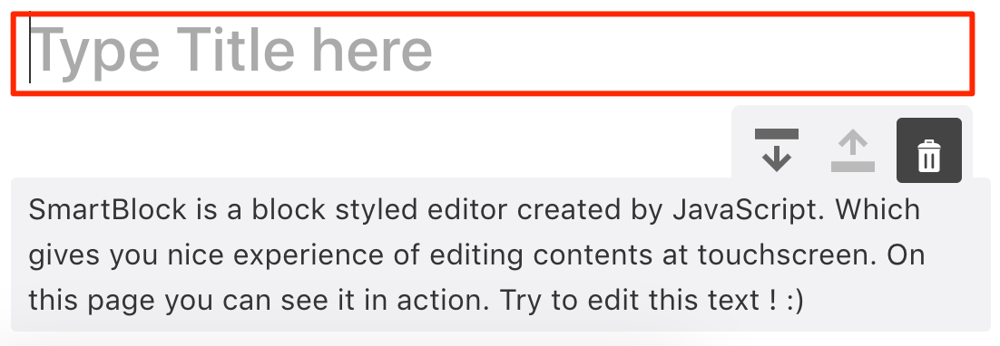

SmartBlock Component can have following props

```ts
export type AppProps = {
  onChange?(output: Output): void;
  onTitleChange?(title: string): void;
  onInit?(json: { schema: Schema }): void;
  json?: OutputJson;
  html?: string;
  markdown?: string;
  showdown?: showdown;
  extensions?: Extension[];
  showBackBtn?: boolean;
  autoSave?: boolean;
  showTitle?: boolean;
  titleText?: string;
  outputMarkdown?: boolean;
  full?: boolean;
  getEditorRef?(div: React.MutableRefObject<HTMLDivElement>): void;
}
```

### Props to Render title

Sometimes, You may want to edit the title and the content separetelly.



```jsx
import * as React from 'react';
import { render } from 'react-dom';
import 'smartblock/css/smartblock.css';
import {
  SmartBlock,
} from 'smartblock';

render(<>
  <SmartBlock
    showTitle
    titleText="Title Here"
    html={'<h2>Hello World</h2><p>hello</p>'}
    onChange={({ json, html }) => {
      console.log(json, html);
    }}
  />
</>, document.getElementById("app"));
```

### Use markdown for I/O

You can use markdown library `showdown` to import and export markdown

```jsx
import showdown from 'showdown';
import * as React from 'react';
import { render } from 'react-dom';
import 'smartblock/css/smartblock.css';
import { SmartBlock, Extensions } from 'smartblock';

render(<>
  <SmartBlock
    extensions={Extensions}
    showdown={showdown}
    markdown={`# Hello World`}
    outputMarkdown
    onChange={({ markdown }) => { console.log(markdown);}}
  />
</>, document.getElementById("app"));
```


### AutoSave

The content will be stored on the localStorage.
Once stored, Regardless of the `html` props, the content will be loaded from localStorage.

```jsx
import * as showdown from 'showdown';
import * as React from 'react';
import { render } from 'react-dom';
import 'smartblock/css/smartblock.css';
import { SmartBlock, Extensions } from 'smartblock';

render(<>
  <SmartBlock
    extensions={Extensions}
    autoSave
    html={"Hello World"}
    onChange={({ html }) => { console.log(html);}}
  />
</>, document.getElementById("app"));
```
