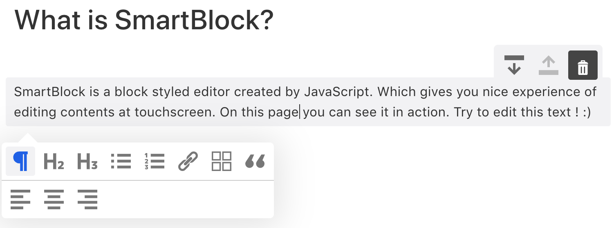

By default, SmartEditor will look like this



```jsx
import * as React from 'react';
import { render } from 'react-dom';
import { SmartBlock, GlobalStyle, Extensions } from 'smartblock';

render(<>
  <GlobalStyle />
  <SmartBlock 
    extensions={Extensions}
    html={'<h2>Hello World</h2><p>hello</p>'}
    onChange={({ json, html }) => { console.log(json, html);}}  
  />
</>, document.getElementById("app"));
```

As you can see you can use 8 blocks by default

- Paragraph
- Heading2
- Heading3
- Unorderd List
- Ordered List
- Blockquote
- Table
- Code

### Use Other Blocks

SmartBlock has extra blocks inside

- Heading1
- Heading4
- Heading5
- Heading6
- Image

You can add extra blocks like below

```jsx
import * as React from 'react';
import { render } from 'react-dom';
import { SmartBlock, GlobalStyle, Extensions, Image, Heading1 } from 'smartblock';

Extensions.push(new Image());
Extensions.push(new Heading1());

render(<>
  <GlobalStyle />
  <SmartBlock 
    extensions={Extensions}
    html={'<h2>Hello World</h2><p>hello</p>'}
    onChange={({ json, html }) => { console.log(json, html);}}  
  />
</>, document.getElementById("app"));
```

If you want to choose blocks from scratch you can code like this

```jsx
import * as React from 'react';
import { render } from 'react-dom';
import { 
  SmartBlock, 
  GlobalStyle, 
  Paragraph, 
  Heading1, 
  Heading2, 
  Trash, 
  MoveUp, 
  MoveDown 
} from 'smartblock';

const extensions = [
  new Paragraph(),
  new Heading1(),
  new Heading2(),
  new Trash(),
  new MoveUp(),
  new MoveDown()
];

render(<>
  <GlobalStyle />
  <SmartBlock 
    extensions={extensions}
    html={'<h2>Hello World</h2><p>hello</p>'}
    onChange={({ json, html }) => { console.log(json, html);}}  
  />
</>, document.getElementById("app"));
```

### Use markdown for I/O

You can use markdown library `showdown` to import and export markdown

```jsx
import showdown from 'showdown';
import * as React from 'react';
import { render } from 'react-dom';
import { SmartBlock, GlobalStyle, Extensions } from 'smartblock';

render(<>
  <GlobalStyle />
  <SmartBlock 
    extensions={Extensions}
    showdown={showdown}
    markdown={`# Hello World`}
    onChange={({ markdown }) => { console.log(markdown);}}  
  />
</>, document.getElementById("app"));
```

### Reduce Bundle Size

If you have to reduce the bundle size, you can code like below.


```jsx
import * as React from 'react';
import { render } from 'react-dom';
import SmartBlock from 'smartblock/lib/components/smartblock';
import GlobalStyle from 'smartblock/lib/utils/style';
import Paragraph from 'smartblock/lib/extensions/paragraph';
import Heading1 from 'smartblock/lib/extensions/heading1';
import Heading2 from 'smartblock/lib/extensions/heading2';
import Trash from 'smartblock/lib/extensions/trash';
import MoveUp from 'smartblock/lib/extensions/move-up';
import MoveDown from 'smartblock/lib/extensions/move-down';

const extensions = [
  new Paragraph(),
  new Heading1(),
  new Heading2(),
  new Trash(),
  new MoveUp(),
  new MoveDown()
];

render(<>
  <GlobalStyle />
  <SmartBlock 
    extensions={Extensions}
    html={'<h2>Hello World</h2><p>hello</p>'}
    onChange={({ json, html }) => { console.log(json, html);}}  
  />
</>, document.getElementById("app"));
```