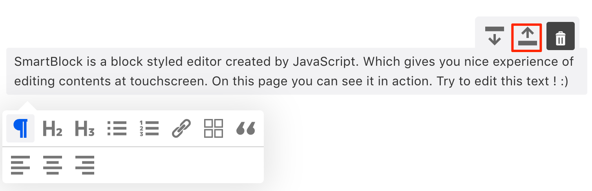
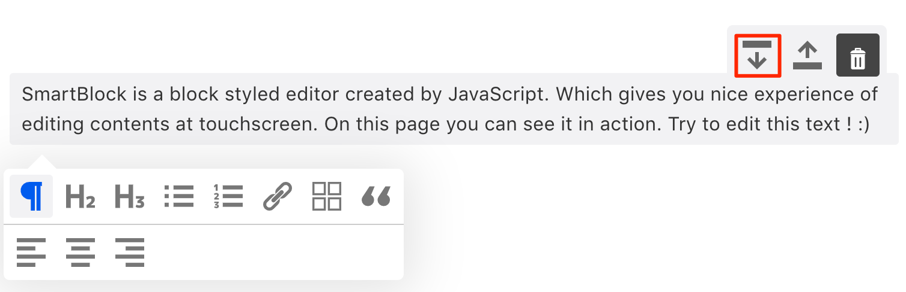
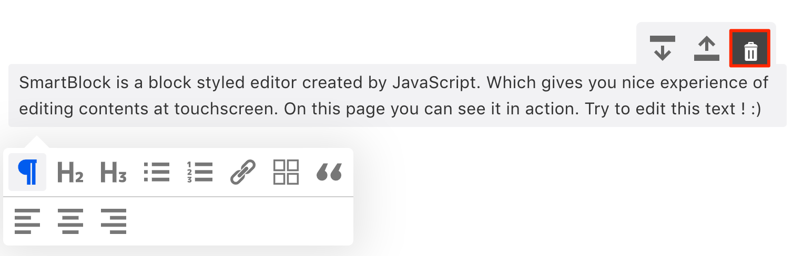

Extensions are not only blocks or marks, You can extend the SmartBlock by Util Extensions
SmartBlock already has all util extensions as default
but if you don't need it you can import what you really need and pass it to the SmartBlock component.

### MoveUp



```jsx
import * as React from 'react';
import { render } from 'react-dom';
import 'smartblock/css/smartblock.css';
import { 
  SmartBlock, 
  Paragraph,
  DefaultKeys, // Util Extension
  DefaultPlugins, // Util Extension
  MoveUp, // Util Extension
} from 'smartblock';

const extensions = [
  new Paragraph(),
  new DefaultKeys(),
  new DefaultPlugins(),
  new MoveUp()
];

render(<>
  <SmartBlock 
    extensions={extensions}
    html={'<p>Hello world</p>'}
    onChange={({ json, html }) => { console.log(json, html);}}  
  />
</>, document.getElementById("app"));
```

### MoveDown



```jsx
import * as React from 'react';
import { render } from 'react-dom';
import 'smartblock/css/smartblock.css';
import { 
  SmartBlock, 
  Paragraph,
  DefaultKeys, // Util Extension
  DefaultPlugins, // Util Extension
  MoveDown, // Util Extension
} from 'smartblock';

const extensions = [
  new Paragraph(),
  new DefaultKeys(),
  new DefaultPlugins(),
  new MoveDown()
];

render(<>
  <SmartBlock 
    extensions={extensions}
    html={'<p>Hello world</p>'}
    onChange={({ json, html }) => { console.log(json, html);}}  
  />
</>, document.getElementById("app"));
```

### Trash



```jsx
import * as React from 'react';
import { render } from 'react-dom';
import 'smartblock/css/smartblock.css';
import { 
  SmartBlock, 
  Paragraph,
  DefaultKeys, // Util Extension
  DefaultPlugins, // Util Extension
  Trash, // Util Extension
} from 'smartblock';

const extensions = [
  new Paragraph(),
  new DefaultKeys(),
  new DefaultPlugins(),
  new Trash()
];

render(<>
  <SmartBlock 
    extensions={extensions}
    html={'<p>Hello world</p>'}
    onChange={({ json, html }) => { console.log(json, html);}}  
  />
</>, document.getElementById("app"));
```

#### Option

You can change message when someone push the trash button with smartphone


```js
new Trash({
  i18n: {
    remove_block: 'Are you sure you want to remove the block?'
  }
})
```